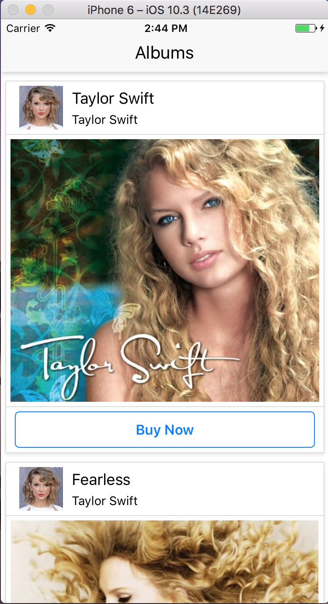

# Albums

This is a React Native application built using Stephen Grider's 'The Complete React Native and Redux Course' on Udemy. The app calls an API with information on Taylor Swift albums, and renders the five albums in the API. 

## Features
### Users can view:
* artist image
* artist name
* album image
* album title

They can also click the 'Buy Now' button and be taken to the amazon.com page where they can purchase the album. 

## Screenshot:
[]
